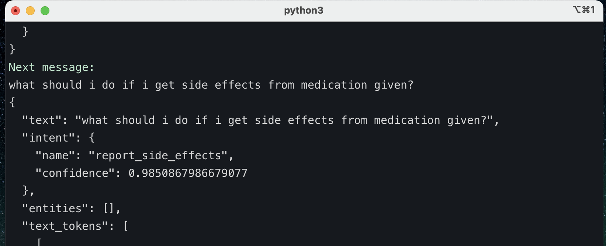
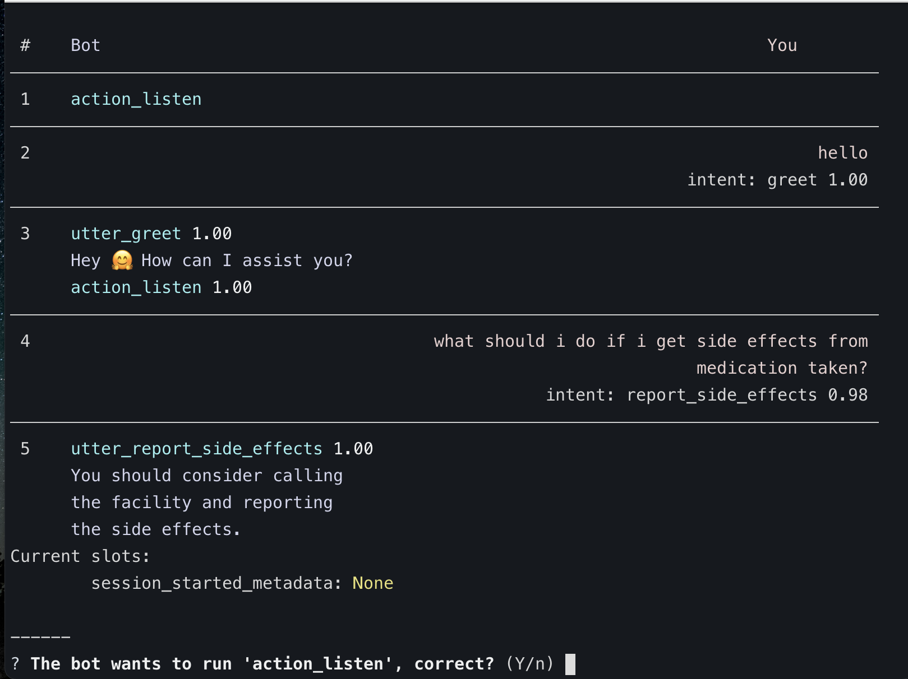
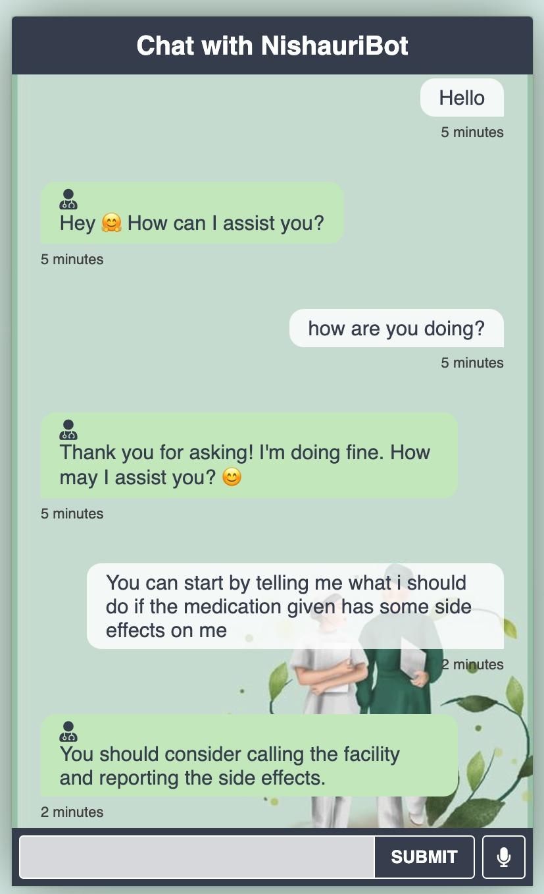

# Nishauri-AI-Chatbot

## Introduction and Overview

Welcome to the Nishauri-AI-Chatbot project! The aim of this project is to develop an AI-powered chatbot that integrates seamlessly with popular messaging platforms like WhatsApp and MHealth solutions, such as the Nishauri app. Our chatbot is designed to provide patients with accurate and reliable clinical information, answer their questions, and offer guidance on when to seek medical attention.

## Technologies Used and Data Source

The core technologies used in the development of our chatbot include:

Rasa Open-Source Framework: We leverage the power of the Rasa framework to build a robust conversational AI system. Rasa provides comprehensive tools and libraries for natural language processing, dialogue management, and intent recognition, enabling our chatbot to understand user queries accurately and provide relevant responses.

## Data Preparation

To train our chatbot effectively, we carefully prepared the data using three essential files required by the Rasa models:

1. `nlu.yml`: This file captures the intents, which represent the ideas or goals expressed in a user's message. By providing a range of example messages and mapping them to their corresponding intents, we train our chatbot to recognize user intentions regardless of how they phrase their messages. For example:

```yaml
intent: Greetings
examples:
  - hello
  - Hey
  - Wasssup
  - Hi
  ```


2. `stories.yml`: This file comprises example conversations that guide the chatbot on how to respond appropriately based on the predicted intent of the previous user message in the conversation. For example:

```yaml
intent: greeting
Action: utter_greet
```

3. `rules.yml`: This file outlines specific segments of conversations that should consistently follow a predetermined path, regardless of prior user messages in the conversation. Rules help enforce specific behaviors or actions based on recognized intents. For example
    
```yaml
rules:
  - intent: nlu_fallback
    Action: utter_please_rephrase
```

## Architecture and Design
Steps:
1. User enters a text: The interaction begins with the user entering a text message or query into the chatbot interface. This text serves as the input for the machine learning models powering the chatbot.

2. Rasa NLU model: The user's text input is then passed through the Rasa NLU (Natural Language Understanding) model. Rasa NLU is responsible for analyzing and classifying the text into its corresponding intent, selecting the intent with the highest probability.


3. Intent identification: Once the correct intent has been determined by Rasa NLU, the next step is to predict the appropriate action or response based on this identified intent. This prediction is performed by the Rasa Core model, which focuses on dialog management to ensure a smooth and intelligent conversation flow.


4. Action or response prediction: Leveraging the insights gathered from the identified intent, Rasa Core predicts the most suitable action or response to be delivered by the chatbot.

5. Output sent to connected channels: Once the action or response has been determined, the output is sent back to the connected channels, including WhatsApp, Facebook Messenger, or web interfaces, where users interact with the chatbot.

## The User Interface
Web UI interface


